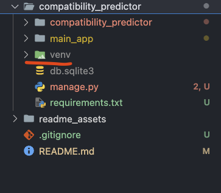
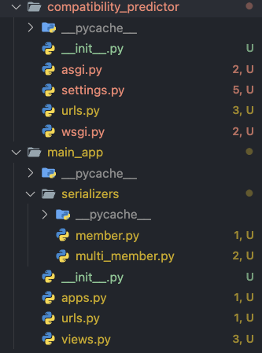
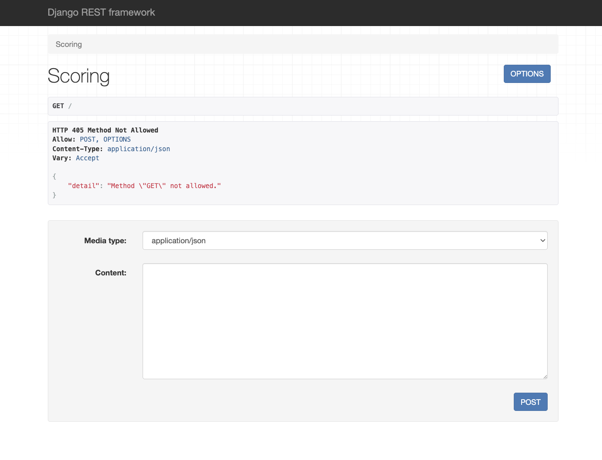
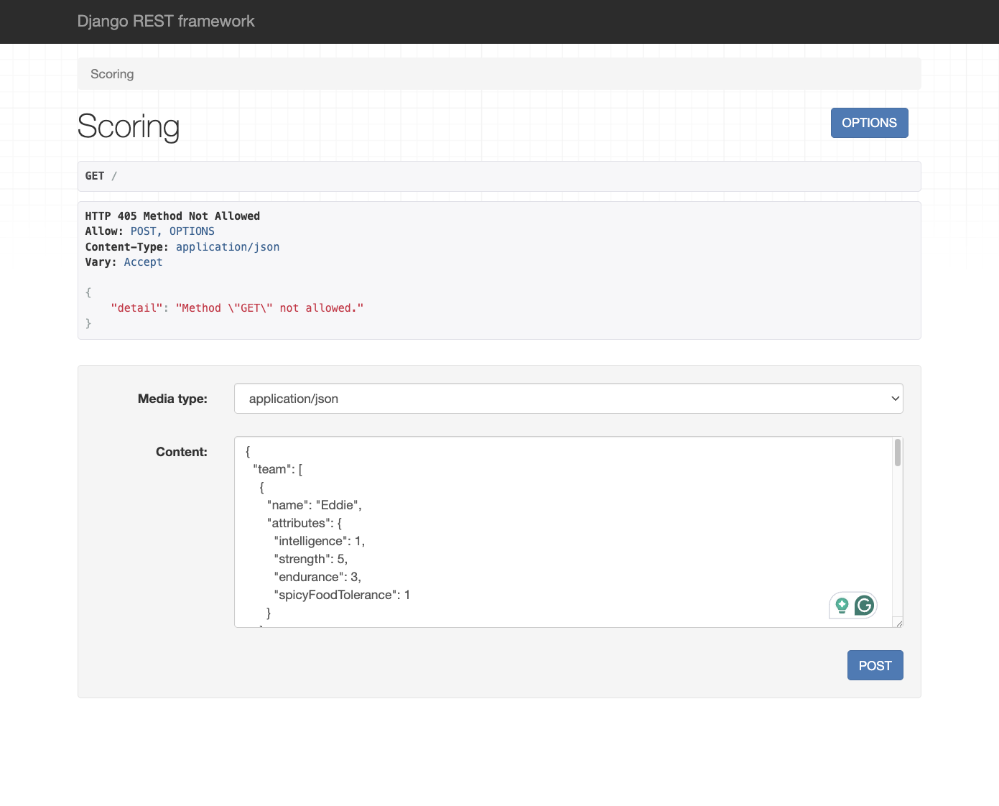
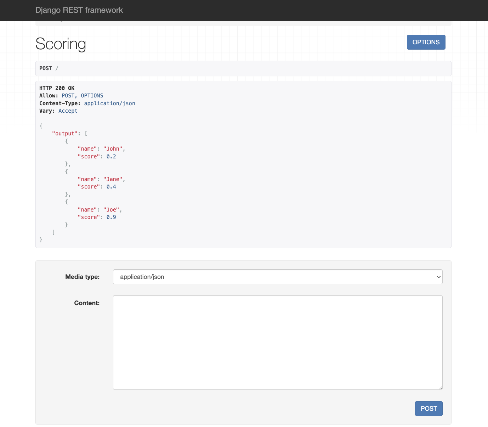
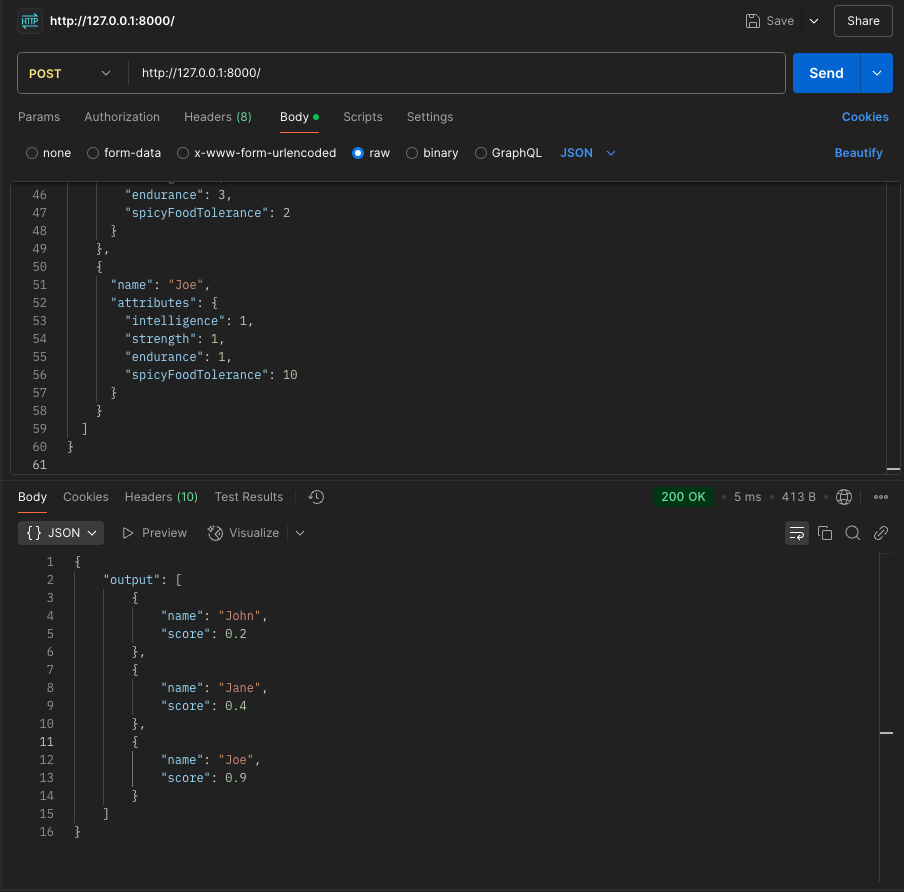
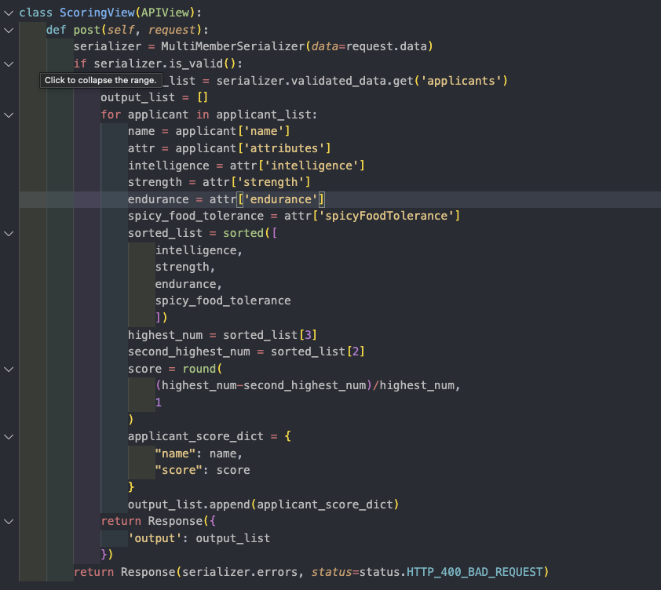
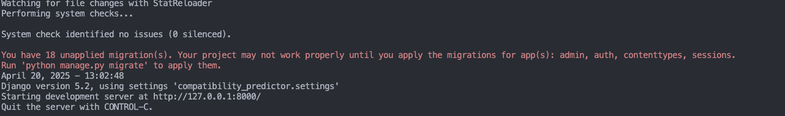

# Datahouse Django Take Home Solution

This project was created as a take-home challenge for Datahouse.  
The goal is to process an input: an array of applicants and an array of team
members, and produces an output: an array of applicants with their respective compatibility
score.

## Project Requirements

- Input and Output must be in JSON
- Compatibility score for each applicant should fall in a range from [0, 1]

## How to use?

### Step 1: Install Python (if you don't have it)
Follow this [link](https://www.python.org/downloads/) for the latest python

### Step 2: Clone the Repo

### Step 3: Create a Venv (virtual environment)


Inside top-level compatibility_predictor directory, depends on your Python version you can either run
```
python -m venv venv
```
or
```
python3 -m venv venv
```

### Step 4: Activate your Venv
In the same directory that you just created the venv

On macOS run:
```
source venv/bin/activate
```
On Window run:
```
venv\Scripts\activate

```
### Step 5: Install dependencies
Depending on your Python version you can either run:
```
pip install -r requirements.txt
```
or 
```
pip3 install -r requirements.txt
```
### Step 6: Run the development server
Depending on your Python version you can either run:
```
python manage.py runserver
```
or 
```
python3 manage.py runserver
```
The site will be found locally at [http://127.0.0.1:8000/](http://127.0.0.1:8000/) 
## Project Structure


The project is organized into two main components inside the top-level compatibility_predictor/ directory:
1. `compatibility_predictor`(Project Configuration)

    This folder hold the core Django setup:
    * `settings.py` - Project settings and configuration
    * `urls.py` - Root URL routing that connects to app-level routes


2. `main_app`  (main application logic)

    This is the main application that handles the scoring functionality:
    * `serializer` - Contain serializer classes to validate and convert between Python dicts and JSON
    * `views.py` - Containing logic for scoring the applicants
    * `urls.py` - Defines route for this app (connected to the root router, currently I have it set as landing)


## Usage
At landing page [http://127.0.0.1:8000/](http://127.0.0.1:8000/) this is the default Django REST framework UI for testing




Copy this given input data from the take-home project 

```
{
  "team": [
    {
      "name": "Eddie",
      "attributes": {
        "intelligence": 1,
        "strength": 5,
        "endurance": 3,
        "spicyFoodTolerance": 1
      }
    },
    {
      "name": "Will",
      "attributes": {
        "intelligence": 9,
        "strength": 4,
        "endurance": 1,
        "spicyFoodTolerance": 6
      }
    },
    {
      "name": "Mike",
      "attributes": {
        "intelligence": 3,
        "strength": 2,
        "endurance": 9,
        "spicyFoodTolerance": 5
      }
    }
  ],
  "applicants": [
    {
      "name": "John",
      "attributes": {
        "intelligence": 4,
        "strength": 5,
        "endurance": 2,
        "spicyFoodTolerance": 1
      }
    },
    {
      "name": "Jane",
      "attributes": {
        "intelligence": 7,
        "strength": 4,
        "endurance": 3,
        "spicyFoodTolerance": 2
      }
    },
    {
      "name": "Joe",
      "attributes": {
        "intelligence": 1,
        "strength": 1,
        "endurance": 1,
        "spicyFoodTolerance": 10
      }
    }
  ]
}

```

Paste the data into the Content box and make sure Media type is selected as `application/json`




After that click the `POST` button to send in a POST request and this is the result




### Optionally
After running the application locally you can also use Postman to test the api.

Copy this into the url in Postman http://127.0.0.1:8000/

Change request into POST

Add the same input data above to the body (select raw and JSON for the dropdown)

Send the Post request




## Logic Break Down
The main logic is located under `views.py` inside `main_app`



In summary, the algorithm calculates the difference between the highest attribute value and the second-highest, then divides that number by the highest value. (In my theory, this shows the skill gap, higher scores indicate a larger difference, while lower scores suggest more balance.)

## Trouble Shooting
You might run into error like 



Although, this error didn't crash my application but in some rare case, it might. To resolve it, simply run

```
python manage.py migrate
```
or
```
python3 manage.py migrate
```

to apply migration, default there is migration from the admin provided by django